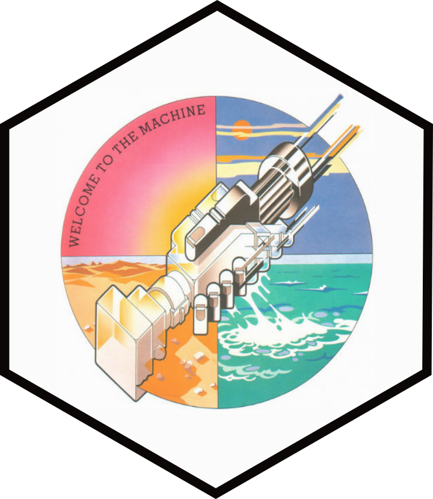

# Machine Learning Club 

## Overview

Welcome to the Machine.

## Guides

* [Setup Guide](docs/setup.md)

## Course notes

* [1. Introduction](docs/1 Introduction.md)
* [2. Neurons - the building blocks](docs/2\ Neurons\ -\ the\ building\ blocks.md
* [3. The 'learning' in machine learning](docs/3 The 'learning' in machine learning)
## Tasks

* **Week 1** - complete the `DataGenerator` and `DataSet` classes

